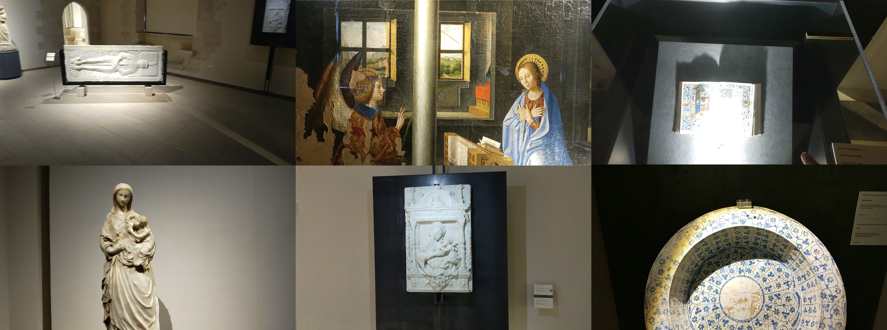

# EGO-CH-GAZE

 <!-- Replace "link_to_image.png" with the actual image URL or file path -->

Welcome to the official GitHub repository for "Learning to Detect Attended Objects in Cultural Sites with Gaze Signals and Weak Object Supervision."

## Overview

To address the challenging problem of attended object detection in cultural sites, we have curated a unique dataset of egocentric images captured by subjects while visiting cultural sites. These images offer a glimpse into the visual experiences of museum-goers and come equipped with labels for artworks and objects that have captured the subjects' attention.

In our work, we present two innovative approaches for attended object detection at various weakly supervised levels. These approaches strike a balance between performance and the amount of supervision required, as demonstrated by our experiments. Specifically, we introduce:

### Box Coordinates Regressor

- Code can be found in the `/code/BBox_regressor` directory.
- This code loads a ResNet model, preprocesses data, and trains a deep learning model for gaze estimation using a Gaussian-based approach. This approach is particularly effective when bounding boxes around attended objects are available for training.

### Fully Convolutional Attended Object Detection

For a detailed explanation of this method, please visit our companion repository at [https://github.com/fpv-iplab/WS-Attended-Object-Detection](https://github.com/fpv-iplab/WS-Attended-Object-Detection).

### Unsupervised Methods

You can explore our unsupervised methods by examining the code in the `/code/Unsupervised` directory. This directory contains various scripts for performing inference using SAM, InSPyReNet, and U-2-Net, all of which offer unique insights into attended object detection without the need for extensive supervision.

